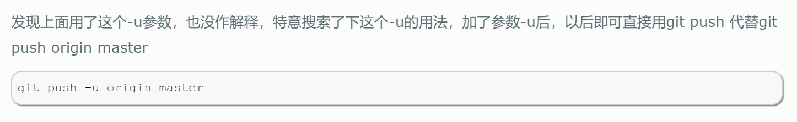

####Git管理项目

```python
#git初始化和第一次推送
git init 
git status(查看更新内容)
git add .
git status
git commit -m "提交的信息"
git remote add [名称] [地址]
git push -u origin master
dir .git 查看git的存储信息
```



```
第二次及其以后的推送
git status
git add .
git commit -m ""
git push
```